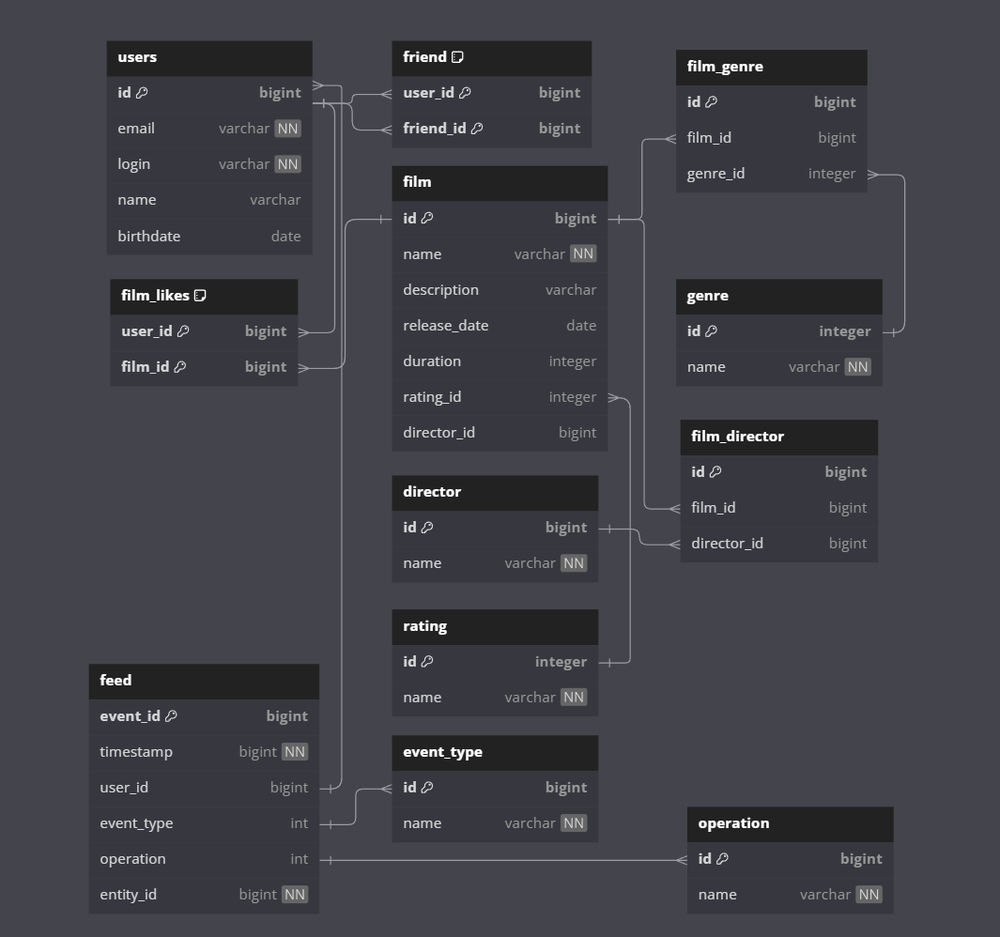

# java-filmorate
Simple REST application, written on Java using Spring Boot.
Allows the user to add, retrieve and delete users and films from database using POST, PUT, GET and DELETE requests.

## Database structure



The image can be changed on the website https://dbdiagram.io.
Code to change the schema:

```
Table users {
  id bigint [primary key]
  email varchar [not null]
  login varchar [not null]
  name varchar
  birthdate date
}

Table friend {
  user_id bigint [primary key]
  friend_id bigint [primary key]
}

Ref: users.id < friend.user_id

Ref: users.id < friend.friend_id


Table film {
  id bigint [primary key]
  name varchar [not null]
  description varchar 
  release_date date
  duration integer
  rating_id integer
  director_id bigint
}

Table film_likes {
  user_id bigint [primary key]
  film_id bigint [primary key]
}

Ref: users.id < film_likes.user_id
Ref: film.id < film_likes.film_id

Table genre {
  id integer [primary key]
  name varchar [not null]
}

Table film_genre {
  id bigint [primary key]
  film_id bigint
  genre_id integer
}

Ref: genre.id < film_genre.genre_id
Ref: film.id < film_genre.film_id

Table rating {
  id integer [primary key]
  name varchar [not null]
}

Ref: rating.id < film.rating_id

Table director {
  id bigint [primary key]
  name varchar [not null]
}

Table film_director {
  id bigint [primary key]
  film_id bigint
  director_id bigint
}

Ref: director.id < film_director.director_id
Ref: film.id < film_director.film_id

Table event_type {
  id bigint [primary key]
  name varchar [not null, unique]
}

Table operation {
  id bigint [primary key]
  name varchar [not null, unique]
}

Table feed {
  event_id bigint [primary key]
  timestamp bigint [not null]
  user_id bigint
  event_type int
  operation int
  entity_id bigint [not null]
}

Ref: feed.user_id < users.id
Ref: feed.event_type < event_type.id
Ref: feed.operation < operation.id
```